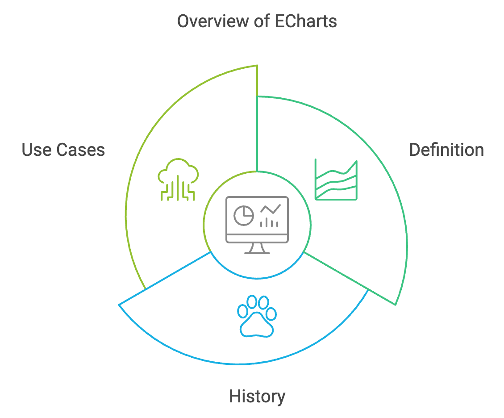
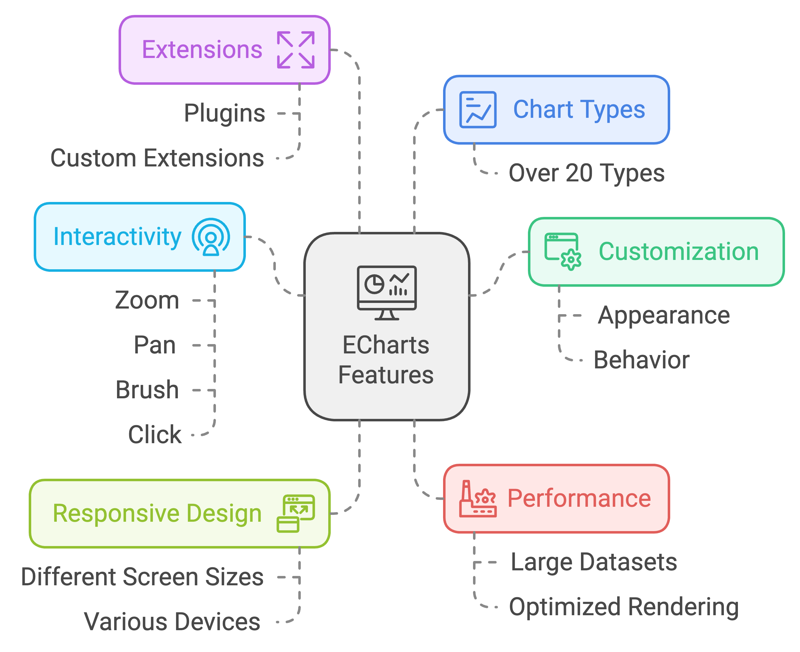

# ECharts.js Course Outline

## 1. Introduction to ECharts

### 1.1 What is ECharts?



- Definition: ECharts is a powerful, interactive charting and data visualization library for JavaScript.
- History: Developed by Baidu, now an Apache Software Foundation project.
- Use cases: Web applications, dashboards, data analysis tools, and more.

### 1.2 Features and capabilities


- Rich chart types: Over 20 built-in chart types.
- Customization: Highly customizable appearance and behavior.
- Interactivity: Zoom, pan, brush, and click interactions.
- Responsive design: Adapts to different screen sizes and devices.
- Performance: Optimized for handling large datasets.
- Extensions: Support for plugins and extensions.

### 1.3 Comparison with other charting libraries


- ECharts vs. D3.js:
  - ECharts: Higher-level API, easier to use for common charts.
  - D3.js: Lower-level, more flexible, steeper learning curve.
- ECharts vs. Chart.js:
  - ECharts: More chart types, better for complex visualizations.
  - Chart.js: Simpler API, lighter weight, focus on basic charts.
- ECharts vs. Highcharts:
  - ECharts: Open-source, free for commercial use.
  - Highcharts: Commercial license required for business use.

### 1.4 Setting up ECharts in a project
- Installation methods:
  1. NPM: `npm install echarts`
  2. CDN: `<script src="https://cdnjs.cloudflare.com/ajax/libs/echarts/5.4.2/echarts.min.js"></script>`
  3. Download and include locally
- Basic HTML structure:
  ```js
  <!DOCTYPE html>
  <html>
  <head>
    <title>ECharts Example</title>
    <script src="path/to/echarts.min.js"></script>
  </head>
  <body>
    <div id="chart-container" style="width: 600px; height: 400px;"></div>
    <script>
      // ECharts initialization code will go here
    </script>
  </body>
  </html>
  ```
- Initializing ECharts:
  ```javascript
  // Initialize ECharts instance
  var myChart = echarts.init(document.getElementById('chart-container'));

  // Specify chart configuration and data
  var option = {
    // Chart options will go here
  };

  // Display the chart using the configuration items and data
  myChart.setOption(option);
  ```

### 1.5 Key concepts to introduce

#### 1.5.1 ECharts Instance
- Definition: An ECharts instance is the core object that manages a single chart.
- Creation: Created using `echarts.init(dom)`, where `dom` is the HTML element to render the chart.
- Purpose: Handles rendering, events, and method calls for a specific chart.
- Key methods:
  - `setOption(option)`: Sets or updates chart configuration
  - `resize()`: Resizes the chart
  - `on(eventName, handler)`: Attaches event listeners
- Example:
  ```javascript
  var myChart = echarts.init(document.getElementById('main'));
  myChart.setOption({
    // chart configuration
  });
  ```

#### 1.5.2 Options Object
- Definition: A JavaScript object that defines the entire configuration of a chart.
- Structure: Contains various properties that specify chart type, data, styling, and behavior.
- Key properties:
  - `title`: Chart title configuration
  - `legend`: Legend configuration
  - `xAxis`, `yAxis`: Axis configurations
  - `series`: Data series configurations
  - `tooltip`: Tooltip configurations
- Flexibility: Can be partially updated using `setOption()` method.
- Example:
  ```javascript
  var option = {
    title: { text: 'My Chart' },
    xAxis: { type: 'category', data: ['A', 'B', 'C'] },
    yAxis: { type: 'value' },
    series: [{
      type: 'bar',
      data: [120, 200, 150]
    }]
  };
  myChart.setOption(option);
  ```

#### 1.5.3 Series and Datasets
- Series:
  - Definition: Represents a single data series in a chart.
  - Properties: Includes data, type of chart, name, styling options.
  - Multiple series: A chart can have multiple series for comparison or composite charts.
- Datasets:
  - Definition: A more flexible way to provide data for charts, separating data from style.
  - Advantages: Allows for easier data updates and sharing data between multiple series.
  - Usage: Define in the `dataset` property of the options object.
- Example:
  ```javascript
  var option = {
    dataset: {
      source: [
        ['product', '2015', '2016', '2017'],
        ['Matcha Latte', 43.3, 85.8, 93.7],
        ['Milk Tea', 83.1, 73.4, 55.1],
        ['Cheese Cocoa', 86.4, 65.2, 82.5],
        ['Walnut Brownie', 72.4, 53.9, 39.1]
      ]
    },
    series: [
      { type: 'bar' },
      { type: 'bar' },
      { type: 'bar' }
    ]
  };
  ```

#### 1.5.4 Coordinate Systems
- Definition: The space in which data is plotted and visualized.
- Types:
  1. Cartesian (Grid) Coordinate System:
     - Most common, used for line, bar, scatter plots, etc.
     - Defined by x and y axes.
  2. Polar Coordinate System:
     - Circular system with angular and radial dimensions.
     - Used for pie charts, radar charts, etc.
  3. Geographic Coordinate System:
     - Used for map visualizations.
     - Requires GeoJSON data for map outlines.
  4. Parallel Coordinate System:
     - For visualizing multi-dimensional data.
     - Each dimension becomes a vertical axis.
- Configuration: Set in the `series` property, often implicitly by chart type.
- Example (Grid system):
  ```javascript
  var option = {
    xAxis: { type: 'category' },
    yAxis: { type: 'value' },
    series: [{
      type: 'line',
      data: [820, 932, 901, 934, 1290, 1330, 1320]
    }]
  };
  ```

Understanding these key concepts provides a solid foundation for working with ECharts. They form the building blocks for creating and customizing various types of charts and visualizations.


