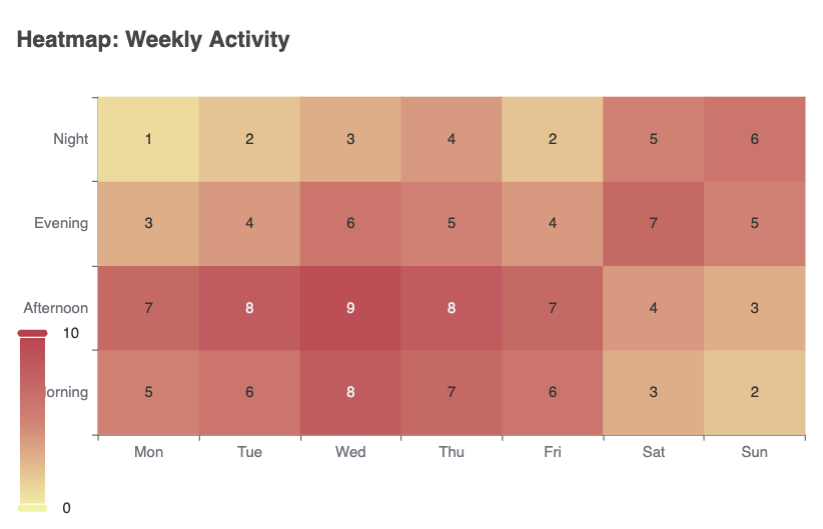

## 2. Basic Concepts

### 2.1 Chart Types Overview
- Introduction to common chart types supported by ECharts:
  1. Line Charts: For showing trends over time
  2. Bar Charts: For comparing quantities across categories
  3. Pie Charts: For showing composition or proportion
  4. Scatter Charts: For showing distribution or correlation
  5. Candlestick Charts: For financial data
  6. Radar Charts: For multivariate data on a two-dimensional chart
  7. Treemap: For hierarchical data
  8. Sunburst: For hierarchical data with a radial layout
  9. Heatmap: For visualizing data through color variations
  10. Graph: For relationship networks
- Brief explanation of when to use each chart type
- Introduction to more advanced chart types (to be covered in detail later)

### 2.2 Common Chart Types
#### 2.2.1 Line Charts
```js

var option = {
                title: { text: 'Line Chart: Monthly Sales' },
                xAxis: { type: 'category', data: ['Jan', 'Feb', 'Mar', 'Apr', 'May', 'Jun'] },
                yAxis: { type: 'value' },
                series: [{
                    data: [150, 230, 224, 218, 135, 147],
                    type: 'line'
                }]
            };

```


#### 2.2.2 Bar Charts
```js
var option = {
                title: { text: 'Bar Chart: Fruit Consumption' },
                xAxis: { type: 'category', data: ['Apple', 'Banana', 'Orange', 'Pear', 'Grapes'] },
                yAxis: { type: 'value' },
                series: [{
                    data: [120, 200, 150, 80, 70],
                    type: 'bar'
                }]
            };
```


#### 2.2.3 Pie Charts
```js
var option = {
                title: { text: 'Pie Chart: Device Usage' },
                series: [{
                    type: 'pie',
                    data: [
                        { value: 335, name: 'Desktop' },
                        { value: 310, name: 'Smartphone' },
                        { value: 234, name: 'Tablet' },
                        { value: 135, name: 'Other' }
                    ]
                }]
            };
```


#### 2.2.4 Scatter Charts
```js
var option = {
                title: { text: 'Scatter Chart: Height vs Weight' },
                xAxis: { type: 'value', name: 'Height (cm)' },
                yAxis: { type: 'value', name: 'Weight (kg)' },
                series: [{
                    type: 'scatter',
                    data: [[161.2, 51.6], [167.5, 59.0], [159.5, 49.2], [175.0, 73.2], [170.2, 62.5]]
                }]
            };
```


#### 2.2.5 Candlestick Charts
```js
var option = {
                title: { text: 'Candlestick Chart: Stock Prices' },
                xAxis: { data: ['2023-10-01', '2023-10-02', '2023-10-03', '2023-10-04', '2023-10-05'] },
                yAxis: { type: 'value' },
                series: [{
                    type: 'candlestick',
                    data: [
                        [20, 34, 10, 38],
                        [40, 35, 30, 50],
                        [31, 38, 33, 44],
                        [38, 15, 5, 42],
                        [40, 50, 35, 55]
                    ]
                }]
            };
```


#### 2.2.6 Radar Charts
```js
 var option = {
                title: { text: 'Radar Chart: Player Stats' },
                radar: {
                    indicator: [
                        { name: 'Attack', max: 100 },
                        { name: 'Defense', max: 100 },
                        { name: 'Speed', max: 100 },
                        { name: 'Power', max: 100 },
                        { name: 'Endurance', max: 100 }
                    ]
                },
                series: [{
                    type: 'radar',
                    data: [
                        { value: [80, 70, 90, 85, 75], name: 'Player A' },
                        { value: [70, 85, 75, 90, 80], name: 'Player B' }
                    ]
                }]
            };
```


#### 2.2.7 Treemap Charts
```js
var option = {
                title: { text: 'Treemap: File System' },
                series: [{
                    type: 'treemap',
                    data: [
                        { name: 'Documents', value: 10, children: [
                            { name: 'Work', value: 5 },
                            { name: 'Personal', value: 5 }
                        ]},
                        { name: 'Pictures', value: 7 },
                        { name: 'Music', value: 5 },
                        { name: 'Videos', value: 2 }
                    ]
                }]
            };
```


#### 2.2.8 Sunburst Charts
```js
var option = {
                title: { text: 'Sunburst: Organization Structure' },
                series: [{
                    type: 'sunburst',
                    data: [{
                        name: 'CEO',
                        children: [{
                            name: 'CTO',
                            children: [
                                { name: 'Dev Team', value: 5 },
                                { name: 'QA Team', value: 3 }
                            ]
                        }, {
                            name: 'CFO',
                            children: [
                                { name: 'Accounting', value: 2 },
                                { name: 'Finance', value: 3 }
                            ]
                        }]
                    }],
                    radius: [0, '90%']
                }]
            };
```


#### 2.2.9 Heatmap Charts
```js
var option = {
                title: { text: 'Heatmap: Weekly Activity' },
                xAxis: { type: 'category', data: ['Mon', 'Tue', 'Wed', 'Thu', 'Fri', 'Sat', 'Sun'] },
                yAxis: { type: 'category', data: ['Morning', 'Afternoon', 'Evening', 'Night'] },
                visualMap: { min: 0, max: 10, calculable: true },
                series: [{
                    type: 'heatmap',
                    data: [
                        [0, 0, 5], [0, 1, 7], [0, 2, 3], [0, 3, 1],
                        [1, 0, 6], [1, 1, 8], [1, 2, 4], [1, 3, 2],
                        [2, 0, 8], [2, 1, 9], [2, 2, 6], [2, 3, 3],
                        [3, 0, 7], [3, 1, 8], [3, 2, 5], [3, 3, 4],
                        [4, 0, 6], [4, 1, 7], [4, 2, 4], [4, 3, 2],
                        [5, 0, 3], [5, 1, 4], [5, 2, 7], [5, 3, 5],
                        [6, 0, 2], [6, 1, 3], [6, 2, 5], [6, 3, 6]
                    ],
                    label: { show: true }
                }]
            };
```



#### 2.2.10 Graph Chart
```javascript
 var option = {
                title: { text: 'Graph: Social Network' },
                series: [{
                    type: 'graph',
                    layout: 'force',
                    data: [
                        { name: 'Node 1', symbolSize: 50 },
                        { name: 'Node 2', symbolSize: 30 },
                        { name: 'Node 3', symbolSize: 40 },
                        { name: 'Node 4', symbolSize: 20 },
                        { name: 'Node 5', symbolSize: 35 }
                    ],
                    links: [
                        { source: 'Node 1', target: 'Node 2' },
                        { source: 'Node 1', target: 'Node 3' },
                        { source: 'Node 2', target: 'Node 4' },
                        { source: 'Node 3', target: 'Node 5' },
                        { source: 'Node 4', target: 'Node 5' }
                    ],
                    roam: true,
                    label: { show: true },
                    force: { repulsion: 100 }
                }]
            };
```

