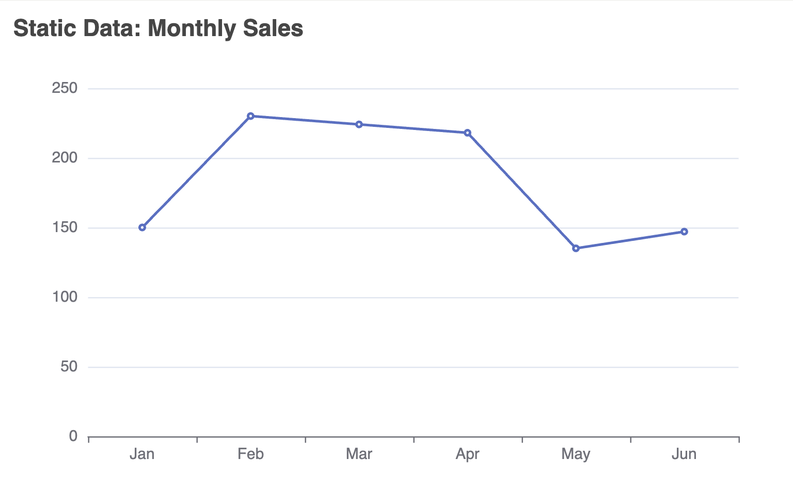
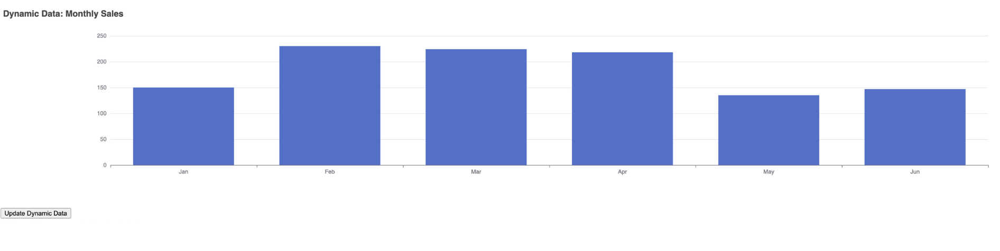
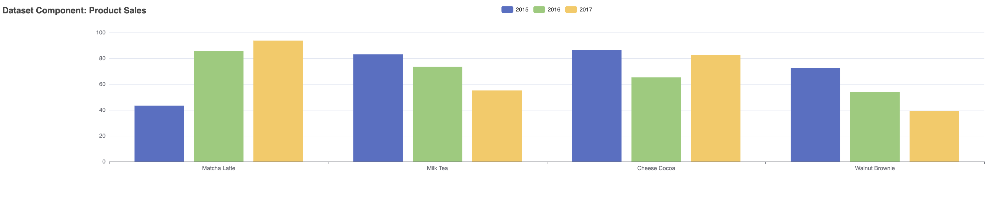
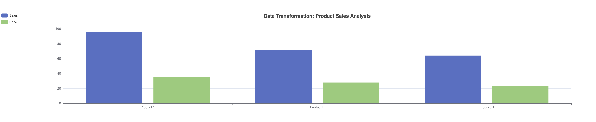

## 4. Data Handling
- Static data
- Dynamic data updates
- Dataset component
- Data transformations

### Static Data Example:
This is the simplest form of data handling in ECharts. The data is directly defined in the configuration object.

```js
series: [{
    data: [150, 230, 224, 218, 135, 147],
    type: 'line'
}]
```

```js
var option = {
                title: { text: 'Static Data: Monthly Sales' },
                xAxis: { type: 'category', data: ['Jan', 'Feb', 'Mar', 'Apr', 'May', 'Jun'] },
                yAxis: { type: 'value' },
                series: [{
                    data: [150, 230, 224, 218, 135, 147],
                    type: 'line'
                }]
            };
```


### Dynamic Data Example:
This example shows how to update data dynamically. We start with an initial dataset and provide a function to update it.
```js
var data = [150, 230, 224, 218, 135, 147];
// ... initial chart setup ...

function updateData() {
    data = data.map(() => Math.round(Math.random() * 300));
    chart.setOption({
        series: [{ data: data }]
    });
}
```



### Dataset Component Example:
The dataset component provides a more powerful way to manage data, especially for multiple series or dimensions.

```js
dataset: {
    dimensions: ['product', '2015', '2016', '2017'],
    source: [
        {product: 'Matcha Latte', '2015': 43.3, '2016': 85.8, '2017': 93.7},
        // ... more data ...
    ]
},
series: [
    {type: 'bar'},
    {type: 'bar'},
    {type: 'bar'}
]
```



### Data Transformation Example:
This advanced example shows how to transform data within ECharts. Here, we're using a linear regression transform on a scatter plot.

- **Raw Data:**
We start with a dataset containing product information, including product names, sales, and prices.
```js
{
    id: 'raw',
    source: [
        ['product', 'sales', 'price'],
        ['Product A', 32, 18],
        ['Product B', 64, 23],
        ['Product C', 96, 35],
        ['Product D', 56, 42],
        ['Product E', 72, 28]
    ]
}
```
- **Data Transformation:**
We create a new dataset 'revenue' that applies two transformations to the 'raw' dataset:

```js
{
    id: 'revenue',
    fromDatasetId: 'raw',
    transform: [
        {
            type: 'filter',
            config: { dimension: 'sales', gte: 60 }
        },
        {
            type: 'sort',
            config: { dimension: 'price', order: 'desc' }
        }
    ]
}
```

- **Visualization:**
We create two bar series to visualize the transformed data:
```js
series: [
    {
        type: 'bar',
        name: 'Sales',
        datasetId: 'revenue',
        encode: {
            x: 'product',
            y: 'sales'
        }
    },
    {
        type: 'bar',
        name: 'Price',
        datasetId: 'revenue',
        encode: {
            x: 'product',
            y: 'price'
        }
    }
]
```


```js
var option = {
                title: { 
                    text: 'Data Transformation: Product Sales Analysis',
                    left: 'center'
                },
                tooltip: {},
                legend: {
                    orient: 'vertical',
                    left: 'left'
                },
                dataset: [
                    {
                        id: 'raw',
                        source: [
                            ['product', 'sales', 'price'],
                            ['Product A', 32, 18],
                            ['Product B', 64, 23],
                            ['Product C', 96, 35],
                            ['Product D', 56, 42],
                            ['Product E', 72, 28]
                        ]
                    },
                    {
                        id: 'revenue',
                        fromDatasetId: 'raw',
                        transform: [
                            {
                                type: 'filter',
                                config: { dimension: 'sales', gte: 60 }
                            },
                            {
                                type: 'sort',
                                config: { dimension: 'price', order: 'desc' }
                            }
                        ]
                    }
                ],
                xAxis: { type: 'category' },
                yAxis: {},
                series: [
                    {
                        type: 'bar',
                        name: 'Sales',
                        datasetId: 'revenue',
                        encode: {
                            x: 'product',
                            y: 'sales'
                        }
                    },
                    {
                        type: 'bar',
                        name: 'Price',
                        datasetId: 'revenue',
                        encode: {
                            x: 'product',
                            y: 'price'
                        }
                    }
                ]
            };
```

