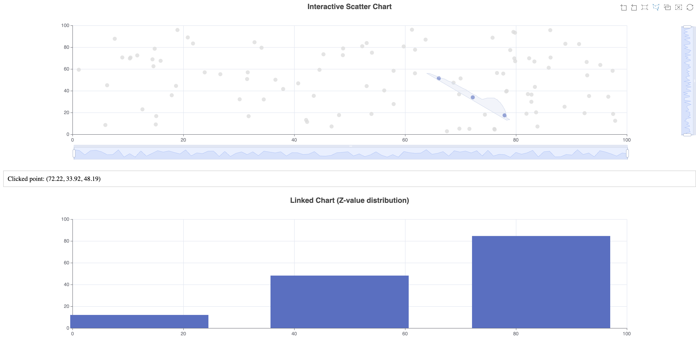

## 5. Interactivity
- Events and event handling
- Zooming and scrolling
- Brushing and linking

### Events and Event Handling:
We've implemented click event handling on the main chart:
```js
mainChart.on('click', function(params) {
    document.getElementById('event-output').innerHTML = 
        `Clicked point: (${params.value[0].toFixed(2)}, ${params.value[1].toFixed(2)}, ${params.value[2].toFixed(2)})`;
});
```

### Zooming and Scrolling:
We've added both slider and inside zoom capabilities:
```js
dataZoom: [
    {
        type: 'slider',
        xAxisIndex: 0,
        start: 0,
        end: 100
    },
    {
        type: 'slider',
        yAxisIndex: 0,
        start: 0,
        end: 100
    },
    {
        type: 'inside',
        xAxisIndex: 0,
        start: 0,
        end: 100
    },
    {
        type: 'inside',
        yAxisIndex: 0,
        start: 0,
        end: 100
    }
]
```

### Brushing and Linking:
We've implemented brushing on the main chart and linked it to update the secondary chart:
```js
toolbox: {
    feature: {
        brush: {
            type: ['rect', 'polygon', 'keep', 'clear']
        }
    }
},
brush: {},
```
This adds brush selection tools to the chart. We then handle the brush selection:
```js
mainChart.on('brushSelected', function (params) {
    // ... process selected data ...
    linkedChart.setOption({
        series: [{
            data: selectedItems
        }]
    });
});
```

### Additional Interactivity:

- **Tooltips:** Hovering over points shows their coordinates.
- **Toolbox:** Includes options for zooming, brushing, and restoring the chart.

