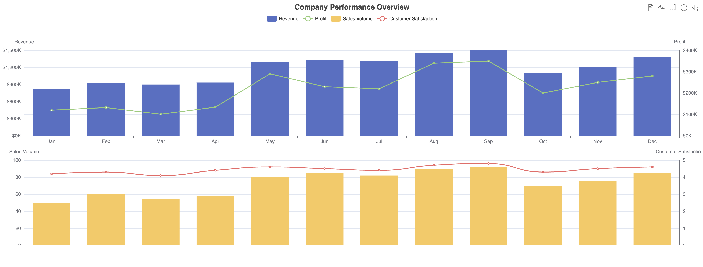

## 6. Composite Charts
- Multiple X and Y axes
- Combining different chart types
- Grid layout for multiple charts

### Multiple X and Y axes:

```js
xAxis: [
    { type: 'category', data: months, gridIndex: 0 },
    { type: 'category', data: months, gridIndex: 1 }
],
yAxis: [
    { type: 'value', name: 'Revenue', position: 'left', ... },
    { type: 'value', name: 'Profit', position: 'right', ... },
    { type: 'value', name: 'Sales Volume', position: 'left', gridIndex: 1, ... },
    { type: 'value', name: 'Customer Satisfaction', position: 'right', gridIndex: 1, ... }
]
```
- The two X-axes are identical but are assigned to different grid areas.
- The Y-axes are positioned on both sides of the chart and have different scales and labels.

### Combining different chart types:
We've combined bar charts and line charts in the same visualization:
```js
series: [
    { name: 'Revenue', type: 'bar', data: revenue, yAxisIndex: 0 },
    { name: 'Profit', type: 'line', data: profit, yAxisIndex: 1 },
    { name: 'Sales Volume', type: 'bar', data: salesVolume, xAxisIndex: 1, yAxisIndex: 2 },
    { name: 'Customer Satisfaction', type: 'line', data: customerSatisfaction, xAxisIndex: 1, yAxisIndex: 3, smooth: true }
]
```

- Revenue and Sales Volume are displayed as bar charts.
- Profit and Customer Satisfaction are displayed as line charts.
- Each series is associated with its corresponding Y-axis using `yAxisIndex`.

### Grid layout for multiple charts:
We've used a grid layout to create two separate chart areas:

```js
grid: [
    {left: '3%', right: '3%', top: '20%', height: '35%'},
    {left: '3%', right: '3%', top: '65%', height: '35%'}
]
```
- This creates two chart areas, one above the other.
- Each grid area contains two series (one bar chart and one line chart).

