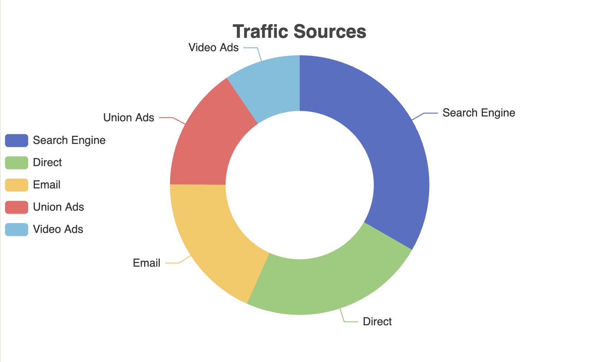

## 7. Responsive Design
- Media query
- Resizing charts
- Adaptive component sizing

### Media Query:
We use CSS media queries to adjust the chart container size based on screen width:
```css
#chart-container { width: 100%; height: 400px; }
@media (max-width: 600px) {
    #chart-container { height: 300px; }
}
```

### Resizing Charts:
We implement a resize function and attach it to window resize and orientation change events:
```js
function resizeChart() {
    if (myChart) {
        myChart.resize();
    }
}

window.addEventListener('resize', function() {
    resizeChart();
    updateChart();
});

window.addEventListener('orientationchange', function() {
    resizeChart();
    updateChart();
});
```

### Adaptive Component Sizing:
We create different chart configurations for small and large screens:
```js
function getOption(isSmallScreen) {
    return {
        title: {
            // ... adaptively change title position and font size
        },
        legend: {
            // ... change legend orientation and position based on screen size
        },
        series: [
            {
                // ... adjust pie chart radius and label visibility
            }
        ]
    };
}
```

### Dynamic Updates:
We update the chart configuration when the screen size changes:

```js
function updateChart() {
    var isSmallScreen = window.innerWidth <= 600;
    option = getOption(isSmallScreen);
    myChart.setOption(option);
}
```
