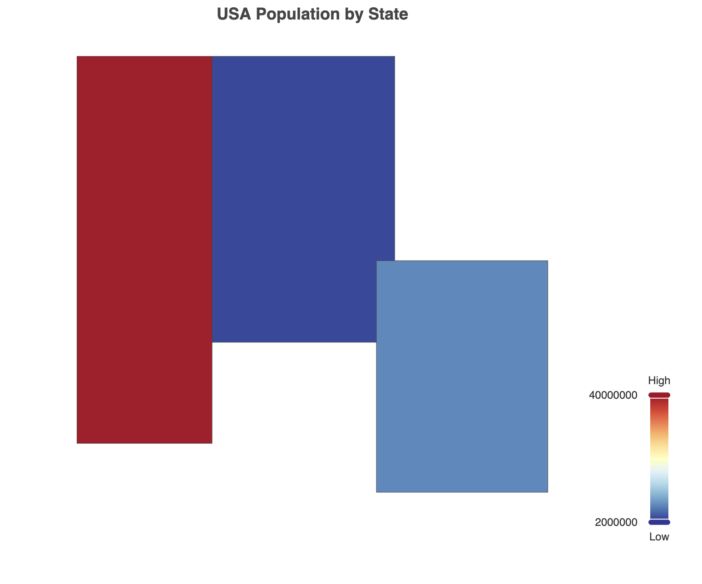
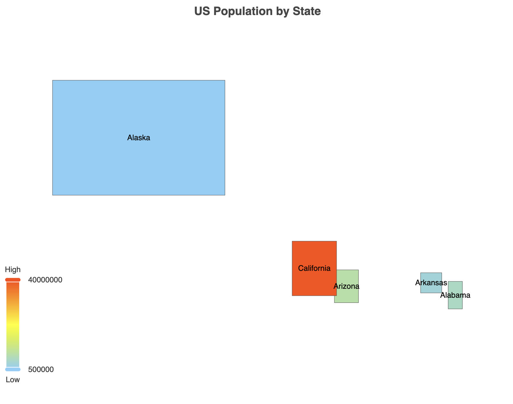

## 9. Maps and Geo-visualization
- GeoJSON with ECharts
- Choropleth maps
- Custom map projections

### GeoJSON Data:

- We define a simplified GeoJSON object `(usaJson)` that contains the geometry data for three US states: California, Nevada, and Arizona.
Each state is represented as a "Feature" with "properties" (including the state name) and "geometry" (defining the shape of the state).

#### Registering the Map:

We use `echarts.registerMap('USA', usaJson)` to register our custom GeoJSON data with ECharts, giving it the name 'USA'.

#### Chart Configuration:

We create an ECharts instance and set up the configuration options:

- `title:` Sets the chart title.
- `tooltip:` Configures tooltips to show state names and population when hovering.
- `visualMap:` Sets up a color scale based on population, with a range from 2 million to 40 million.
- `series:` Defines a map series using our registered 'USA' map.

#### Data:

We provide sample population data for each state in the `data` array.

#### Interactivity:

The `roam: true` option in the series configuration allows users to zoom and pan the map.
The` emphasis` option defines how map areas appear when hovered over.

```javascript
// Specify the configuration items and data for the chart
        var option = {
            title: {
                text: 'USA Population by State',
                left: 'center'
            },
            tooltip: {
                trigger: 'item',
                formatter: '{b}<br/>Population: {c}'
            },
            visualMap: {
                left: 'right',
                min: 2000000,
                max: 40000000,
                inRange: {
                    color: ['#313695', '#4575b4', '#74add1', '#abd9e9', '#e0f3f8', '#ffffbf', '#fee090', '#fdae61', '#f46d43', '#d73027', '#a50026']
                },
                text: ['High', 'Low'],
                calculable: true
            },
            series: [
                {
                    name: 'USA Population',
                    type: 'map',
                    roam: true,
                    map: 'USA',
                    emphasis: {
                        label: {
                            show: true
                        }
                    },
                    data: data
                }
            ]
        };
```




### Choropleth maps:
```js
 // Simplified US map data
        var usaJson = {
            "type": "FeatureCollection",
            "features": [
                {"type":"Feature","properties":{"name":"Alabama"},"geometry":{"type":"Polygon","coordinates":[[[-88.2,35],[-88.2,30.2],[-84.9,30.2],[-84.9,35],[-88.2,35]]]}},
                {"type":"Feature","properties":{"name":"Alaska"},"geometry":{"type":"Polygon","coordinates":[[[-180,50],[-180,70],[-140,70],[-140,50],[-180,50]]]}},
                {"type":"Feature","properties":{"name":"Arizona"},"geometry":{"type":"Polygon","coordinates":[[[-114.6,37],[-114.6,31.3],[-109,31.3],[-109,37],[-114.6,37]]]}},
                {"type":"Feature","properties":{"name":"Arkansas"},"geometry":{"type":"Polygon","coordinates":[[[-94.6,36.5],[-94.6,33],[-89.7,33],[-89.7,36.5],[-94.6,36.5]]]}},
                {"type":"Feature","properties":{"name":"California"},"geometry":{"type":"Polygon","coordinates":[[[-124.4,42],[-124.4,32.5],[-114.1,32.5],[-114.1,42],[-124.4,42]]]}}
            ]
        };

        echarts.registerMap('USA', usaJson);

        var data = [
            {name: 'Alabama', value: 4903185},
            {name: 'Alaska', value: 731545},
            {name: 'Arizona', value: 7278717},
            {name: 'Arkansas', value: 3017804},
            {name: 'California', value: 39512223}
        ];

        var option = {
            title: {
                text: 'US Population by State',
                left: 'center'
            },
            tooltip: {
                trigger: 'item',
                formatter: '{b}: {c}'
            },
            visualMap: {
                min: 500000,
                max: 40000000,
                text: ['High', 'Low'],
                realtime: false,
                calculable: true,
                inRange: {
                    color: ['lightskyblue', 'yellow', 'orangered']
                }
            },
            series: [
                {
                    name: 'USA Population',
                    type: 'map',
                    mapType: 'USA',
                    roam: true,
                    data: data,
                    label: {
                        show: true
                    },
                    emphasis: {
                        label: {
                            show: true
                        }
                    }
                }
            ]
        };
```


